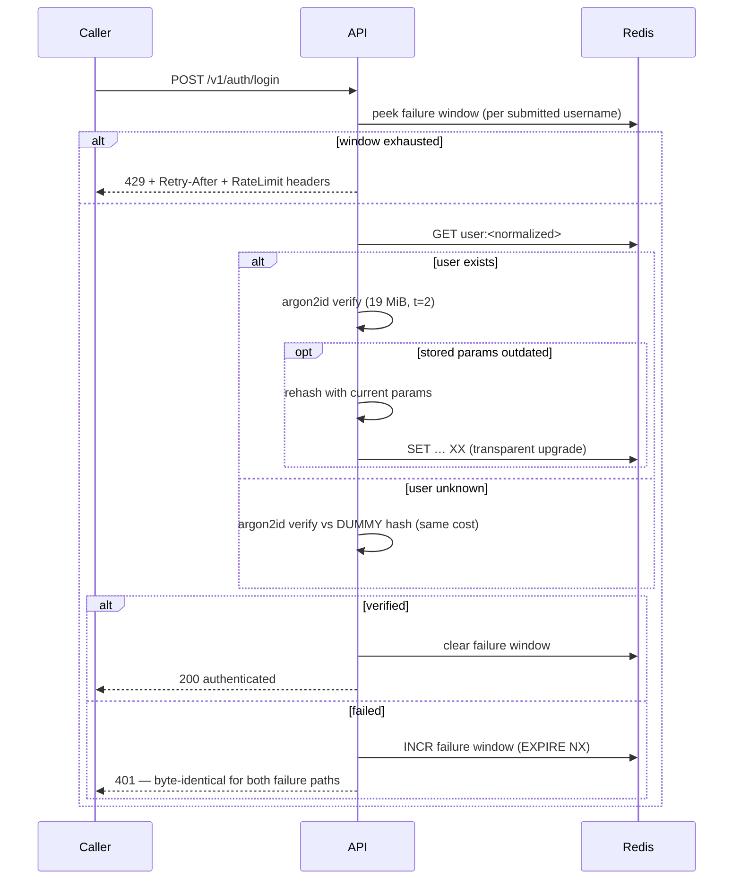

# Authentication API

An internal REST service that creates logins and verifies credentials —
built to production quality on **Node.js 24 LTS**, **TypeScript 6 (strict)**,
**Fastify 5**, and **Redis 8**, with **Argon2id** password storage.

Every error is an [RFC 9457 Problem Details](https://www.rfc-editor.org/rfc/rfc9457)
response; the OpenAPI contract is generated from the same schemas that
validate requests at runtime (and CI fails if the committed spec drifts);
security decisions cite the standards they implement (NIST SP 800-63B-4,
OWASP Password Storage Cheat Sheet) rather than folklore.

> **Contents:** [Quickstart](#quickstart) · [API](#api) · [Errors](#error-model) ·
> [Security](#security-model) · [Performance](#measured-performance) ·
> [Scaling](#scalability) · [Testing](#testing) · [CI/CD](#cicd--infrastructure) ·
> [Decisions (ADRs)](#design-decisions) · [Approach](#approach--ai-workflow)

## Quickstart

```bash
docker compose up --build        # API on :3000, Redis with AOF durability
```

- Interactive docs (Swagger UI): **http://localhost:3000/docs**
- Machine-readable contract: [`openapi.json`](openapi.json) (also served at `/docs/json`)
- Click-to-run requests: [`requests.http`](requests.http) (VS Code REST Client / JetBrains)
- Generated TypeScript client types for consumers: [`client/api.d.ts`](client/api.d.ts)

```bash
# create a login
curl -i -X POST localhost:3000/v1/users \
  -H 'content-type: application/json' \
  -d '{"username": "alice", "password": "correct horse battery staple"}'
# → 201 Created, Location: /v1/users/alice

# authenticate it
curl -i -X POST localhost:3000/v1/auth/login \
  -H 'content-type: application/json' \
  -d '{"username": "alice", "password": "correct horse battery staple"}'
# → 200 {"authenticated":true,"user":{"username":"alice"}}
```

Hot-reload development (no local Node needed):
`docker compose -f compose.yaml -f compose.dev.yaml up --build`
Or natively: Node ≥ 24, `npm ci && npm run dev` (Redis via compose or any `REDIS_URL`).

## API

| Endpoint                                   | Success                      | Failures                                              |
| ------------------------------------------ | ---------------------------- | ----------------------------------------------------- |
| `POST /v1/users` — create a login          | **201 Created** + `Location` | 400 validation · 409 taken · 422 policy · 415/413/429 |
| `POST /v1/auth/login` — verify credentials | **200 OK**                   | **401** invalid credentials · 429 rate limited        |
| `GET /healthz` — liveness                  | 200                          | —                                                     |
| `GET /readyz` — readiness (Redis PING)     | 200                          | 503                                                   |

Two spec notes, both deliberate and documented:
creation returns **201** (RFC 9110 semantics) rather than a literal 200 —
rationale in [ADR-0004](docs/adr/0004-201-created-deviation.md); and login
issues **no token/session** because the brief asks only for verification —
[ADR-0005](docs/adr/0005-no-sessions-or-jwt.md).

**Usernames** are case-insensitively unique (`Alice` = `alice`), NFC-
normalized, 3–32 chars of `a-z 0-9 . _ -` — homoglyph and case-trick
duplicate accounts are impossible by construction.

**Passwords** follow NIST SP 800-63B-4 (final, July 2025): minimum **15
code points** (single-factor SHALL), no composition rules, spaces/emoji
welcome, screened against a 10k common-password blocklist and the username,
rejected — never truncated — beyond 256. Details:
[ADR-0007](docs/adr/0007-nist-password-policy.md).

## Error model

Every non-2xx response is `application/problem+json` (RFC 9457) with a
stable machine-readable `code`, a `requestId` correlating to the logs, and —
on validation failures — **all** violated rules at once:

```json
{
  "type": "/problems/weak-password",
  "title": "Password does not meet policy",
  "status": 422,
  "code": "WEAK_PASSWORD",
  "detail": "The supplied password does not meet the password policy.",
  "instance": "/v1/users",
  "requestId": "9f1c1e0a-…",
  "errors": [
    {
      "field": "password",
      "rule": "min_length",
      "message": "must be at least 15 characters — a long passphrase (spaces allowed) is ideal"
    },
    {
      "field": "password",
      "rule": "blocklist",
      "message": "is on the list of commonly used passwords"
    }
  ]
}
```

Problem registry: `validation-error` 400 · `malformed-body` 400 ·
`invalid-credentials` 401 · `not-found` 404 · `method-not-allowed` 405 (with
`Allow`) · `username-taken` 409 · `payload-too-large` 413 ·
`unsupported-media-type` 415 · `invalid-username` 422 · `weak-password` 422 ·
`rate-limited` 429 (with `Retry-After`) · `internal-error` 500 ·
`service-unavailable` 503.

The one place detail is _withheld_ on purpose: login failures are a generic
401 — see below.

## Security model

The login flow, including the branch most implementations miss:



Measured on this machine — wrong password vs unknown user, three runs each:
**16–19 ms both**, statistically indistinguishable. An integration test also
asserts the response _bodies_ are identical.

Highlights (full threat model, rejected alternatives, and the production
punch list live in [SECURITY.md](SECURITY.md)):

- **Argon2id** at OWASP parameters, PHC strings, **rehash-on-login**
  parameter upgrades ([ADR-0002](docs/adr/0002-argon2id-over-bcrypt.md))
- **Atomic uniqueness** via `SET NX` — the duplicate-registration race is
  structurally impossible, and a test fires 8 concurrent registrations to
  prove it ([ADR-0003](docs/adr/0003-atomic-uniqueness-set-nx.md))
- **Two Redis-backed rate limits** — per-IP and per-username failures
  (clears on success), correct across any number of replicas, emitting the
  IETF draft `RateLimit`/`RateLimit-Policy` headers
  ([ADR-0008](docs/adr/0008-custom-redis-rate-limiter.md))
- **Hash concurrency cap**: each in-flight verify reserves 19 MiB, so
  hashing is gated (default 8 → worst case ~152 MiB) instead of letting a
  login burst become a memory DoS
- **Strict input handling**: unknown JSON fields rejected (not silently
  stripped — Fastify's default), no type coercion, 16 KiB body cap,
  JSON-only (415 otherwise)
- **Response whitelisting**: fast-json-stringify serializes only schema
  fields per status — a hash cannot leak into a response
- **Audit trail**: structured events (`user.created`, `auth.failure`, …)
  with request ids and never credentials

## Measured performance

`npm run bench` (autocannon, 10s runs, WSL2 on consumer hardware — treat as
relative):

| Scenario                             | Throughput    | p50   | p99   |
| ------------------------------------ | ------------- | ----- | ----- |
| `GET /healthz` (framework overhead)  | ~25,000 req/s | 0 ms  | 2 ms  |
| `POST /v1/auth/login`, 8 connections | **208 req/s** | 37 ms | 50 ms |

The login ceiling is the security budget working, not a bottleneck:
**ceiling ≈ HASH_MAX_CONCURRENCY ÷ verify-time = 8 ÷ 0.037s ≈ 216 req/s** —
the measurement lands within 4% of the math. Need more? Scale horizontally
(stateless app tier) or raise `HASH_MAX_CONCURRENCY` with its ~19 MiB/slot
memory price. Reproduce: `RATE_LIMIT_IP_MAX=100000 docker compose up -d && npm run bench`
(the default IP limit otherwise throttles the bench — correctly).

## Scalability

- **Stateless app tier** — all state (users, rate windows) in Redis;
  replicas need zero coordination. The limiter stays correct at N instances
  _because_ it lives in Redis.
- **Load shedding** — `@fastify/under-pressure` returns 503 + `Retry-After`
  when the event loop lags: predictable failure instead of meltdown.
- **Zero-downtime deploys** — graceful shutdown drains in-flight requests
  (SIGTERM, 10s budget); `/readyz` gates load-balancer routing on Redis
  health.
- **Durability** — Redis runs AOF `everysec` in compose (≤1s crash-loss
  window); production notes (RDB+AOF, or Postgres as system of record) in
  [SECURITY.md](SECURITY.md) and [docs/architecture.md](docs/architecture.md).

## Testing

**61 tests, ~96% line coverage** (thresholds enforced in CI), in four layers:

1. **Unit** — password policy, username normalization, problem registry.
2. **Property-based** (fast-check) — thousands of adversarial Unicode inputs
   against the validators: normalization idempotence, never-throws, policy
   invariants.
3. **Integration** (Testcontainers, real `redis:8-alpine` — the identical
   suite runs on a laptop and in CI) — including the concurrent-duplicate
   race, the byte-identical-401 assertion, rehash-on-login, both rate
   limiters, and every protocol edge (405+Allow, 413, 415, malformed JSON).
4. **Contract** — live responses validated against the _committed_
   `openapi.json`, which CI regenerates and diffs, so docs cannot lie.

```bash
npm test                 # everything (Docker required for integration)
npm run test:unit        # fast feedback
npm run test:coverage    # + enforced thresholds
```

## CI/CD & infrastructure

**GitHub Actions** ([ci.yml](.github/workflows/ci.yml)): lint (ESLint 10
strict-type-checked + Prettier) → typecheck → tests vs real Redis →
coverage gate → `npm audit` (high+) → OpenAPI drift check → Spectral
contract lint → Docker build with a **non-root assertion** (the image ships
zero devDependencies and runs as uid 1000, enforced in CI). Plus
[CodeQL](.github/workflows/codeql.yml) security analysis and
[Dependabot](.github/dependabot.yml) across npm/actions/docker/terraform.

**Infrastructure as code** ([infra/](infra/)): OpenTofu for AWS —
ECR (scan-on-push) → ECS Fargate behind an ALB (health-checked on
`/readyz`) → ElastiCache Redis with encryption at rest + in transit and
auth token via SSM, target-tracking autoscaling. Statically validated
(`tofu validate`, `tflint`, `checkov`) in [iac.yml](.github/workflows/iac.yml);
deliberately **not applied** — the demo stays zero-cost. See
[infra/README.md](infra/README.md).

## Design decisions

Each significant choice is an ADR in [docs/adr/](docs/adr/):

| ADR                                                | Decision                                                                   |
| -------------------------------------------------- | -------------------------------------------------------------------------- |
| [0001](docs/adr/0001-fastify-over-express.md)      | Fastify 5 over Express 5 — schema-first validation + response whitelisting |
| [0002](docs/adr/0002-argon2id-over-bcrypt.md)      | Argon2id over bcrypt — OWASP ordering, 72-byte cliff, rehash-on-login      |
| [0003](docs/adr/0003-atomic-uniqueness-set-nx.md)  | `SET NX` atomic uniqueness — no check-then-set race                        |
| [0004](docs/adr/0004-201-created-deviation.md)     | 201 Created — documented deviation from the brief's "200 OK"               |
| [0005](docs/adr/0005-no-sessions-or-jwt.md)        | No JWT/sessions — scope discipline                                         |
| [0006](docs/adr/0006-rfc9457-problem-details.md)   | RFC 9457 Problem Details everywhere                                        |
| [0007](docs/adr/0007-nist-password-policy.md)      | NIST 800-63B-4 policy — 15+ chars, no composition rules                    |
| [0008](docs/adr/0008-custom-redis-rate-limiter.md) | Purpose-built Redis rate limiter                                           |

Architecture overview (arc42-structured, with diagrams):
[docs/architecture.md](docs/architecture.md).

**Considered and deferred** (one line each, reasoning in SECURITY.md):
`Idempotency-Key` (IETF draft expired 2026-04), `Server-Timing` (rejected —
timing oracle), CORS (no browser callers), OpenTelemetry traces, HIBP
breached-password API, sliding-window limiter, `GET /users/:name`
(rejected — enumeration endpoint).

## Approach & AI workflow

Built with an AI-assisted workflow that I directed end-to-end: multi-agent
web research verified every stack and standards choice against primary
sources (npm registry, IETF datatracker, NIST, OWASP) before a line was
written; implementation was human-reviewed at each step; and before
submission the code was attacked by an adversarial multi-agent review
(security, spec-compliance, and test-adequacy lenses) whose findings were
fixed and re-verified. The full story, including the actual prompts:
[docs/AI_WORKFLOW.md](docs/AI_WORKFLOW.md).

Every architectural and security decision above is mine to defend —
the tooling multiplied research breadth and review depth, not judgment.

## License

MIT
