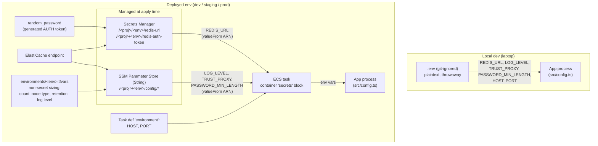

# Configuration & Secrets

How this service is configured, everywhere it runs, and where the line
between **config** and **secrets** is drawn.

## The one principle

> **Secrets** (credentials) live in **AWS Secrets Manager**: rotatable,
> versioned, access-audited via CloudTrail, readable only with an explicit IAM
> grant.
> **Config** (non-sensitive operational settings) lives in **AWS SSM Parameter
> Store** as plain `String` parameters.
> **Nothing sensitive** is ever put in a plain environment variable, an SSM
> `String`, or a file committed to git.

Keeping the two apart is not bureaucracy: it means a secret can be rotated
without a redeploy, config can change without touching a secret store, and a
reviewer can tell at a glance which values are dangerous. The split is enforced
in code (`infra/secrets.tf` vs `infra/config.tf`) and asserted in
`infra/tests/security.tftest.hcl`.

## What the app reads

The app (`src/config.ts`) reads everything from environment variables at boot
and validates them, failing fast on anything malformed. The variables it cares
about:

| Variable                                        | Kind                               | Local source                               | Deployed source                                  |
| ----------------------------------------------- | ---------------------------------- | ------------------------------------------ | ------------------------------------------------ |
| `REDIS_URL`                                     | **secret** (embeds the AUTH token) | `.env` (`redis://localhost:6379`, no auth) | **Secrets Manager** → injected as env by ECS     |
| `LOG_LEVEL`                                     | config                             | `.env`                                     | **SSM Parameter Store** → injected as env by ECS |
| `TRUST_PROXY`                                   | config                             | `.env`                                     | **SSM Parameter Store** → injected as env by ECS |
| `PASSWORD_MIN_LENGTH`                           | config                             | `.env`                                     | **SSM Parameter Store** → injected as env by ECS |
| `HOST`, `PORT`                                  | static infra fact                  | `.env`                                     | ECS task definition (`environment`)              |
| `HASH_*`, `RATE_LIMIT_*`, `PASSWORD_MAX_LENGTH` | config (app defaults)              | `.env` (optional)                          | app defaults (add SSM params to override)        |

In every case the app only ever sees an environment variable; it has no idea
whether that value came from a file, Parameter Store, or Secrets Manager. That
indirection is what lets the same image run unchanged from a laptop to prod.

## Local development

Plaintext, zero cloud dependencies:

```sh
cp .env.example .env      # then edit as needed
docker compose up         # or: npm run dev
```

- `.env` is **git-ignored** (see `.gitignore`) and never committed. `.env.example`
  is the committed, non-secret template.
- `REDIS_URL` locally is `redis://localhost:6379`, a local Redis with **no**
  AUTH token and **no** TLS. There is no real secret on a developer machine, so
  a plaintext file is the right tool; reaching for a secret manager here would
  be theatre.
- This is the only place secrets are plaintext, and the only "secret" is a
  throwaway local one.

## Deployed environments (dev / staging / prod)

Provisioned by the OpenTofu config in `infra/`. Two stores, populated at apply
time (the Redis AUTH token is generated by `random_password`, so no credential
is ever written into the repo):

### Secrets → AWS Secrets Manager (`infra/secrets.tf`)

- `/<project>/<env>/redis-auth-token` — the raw ElastiCache AUTH token on its
  own, so it can be **rotated independently**.
- `/<project>/<env>/redis-url` — the full `rediss://:<token>@host:6379` string
  the app consumes as `REDIS_URL`. It embeds the token, so it is a secret and
  lives here, never in Parameter Store.

### Config → AWS SSM Parameter Store, plain `String` (`infra/config.tf`)

Namespaced under `/<project>/<env>/config/`:

- `LOG_LEVEL`, `TRUST_PROXY`, `PASSWORD_MIN_LENGTH` — injected into the task.
- `REDIS_HOST`, `REDIS_PORT` — the non-secret half of the connection details,
  published as a discoverable catalog (the app uses the assembled `REDIS_URL`
  secret; these make the "host/port are public, only the token is not" boundary
  explicit).

### How the task gets them

The ECS task definition's container `secrets` block (`infra/ecs.tf`) references
each value **by ARN** (`valueFrom`). ECS resolves both Secrets Manager secret
ARNs and SSM parameter ARNs and injects them as environment variables at task
start:

```text
REDIS_URL           <- Secrets Manager  arn:...:secret:/auth-api/prod/redis-url
LOG_LEVEL           <- SSM Parameter     arn:...:parameter/auth-api/prod/config/LOG_LEVEL
TRUST_PROXY         <- SSM Parameter     arn:...:parameter/auth-api/prod/config/TRUST_PROXY
PASSWORD_MIN_LENGTH <- SSM Parameter     arn:...:parameter/auth-api/prod/config/PASSWORD_MIN_LENGTH
```

The resolved values never appear in the task definition, the console, or
`describe-task-definition` output; only the ARNs do.

### Where each value comes from, per environment



## Selecting an environment

Every resource is name-prefixed `<project_name>-<environment>` (see
`infra/locals.tf`) and each environment has a tfvars file with its sizing:

```sh
cd infra

# dev: 1 task, cache.t4g.micro, 7-day logs, debug logging
tofu plan  -var-file=environments/dev.tfvars

# staging: 2 tasks across 2 AZs, cache.t4g.small, 14-day logs
tofu apply -var-file=environments/staging.tfvars

# prod: 3 tasks, wider autoscaling, 30-day logs
tofu apply -var-file=environments/prod.tfvars
```

The `environment` variable has **no default** on purpose: an environment must
be chosen explicitly, and `contains(["dev","staging","prod"], ...)` validation
rejects anything else (asserted in
`infra/tests/environments.tftest.hcl::rejects_invalid_environment`).

|                       | dev             | staging         | prod             |
| --------------------- | --------------- | --------------- | ---------------- |
| `desired_count`       | 1               | 2               | 3                |
| autoscaling min / max | 1 / 3           | 2 / 6           | 3 / 20           |
| `redis_node_type`     | cache.t4g.micro | cache.t4g.small | cache.t4g.small¹ |
| `log_retention_days`  | 7               | 14              | 30               |
| `log_level`           | debug           | info            | info             |

¹ prod may justify a memory-optimised node (e.g. `cache.r7g.large`) plus
`num_cache_clusters >= 2` with Multi-AZ automatic failover; see `infra/redis.tf`.

## Per-environment isolation

Two layers, both important (full detail in the backend comment in
`infra/versions.tf`):

1. **State isolation.** Each environment gets its own state file: a distinct
   S3 backend `key` wired at `init` time
   (`-backend-config="key=auth-api/<env>/terraform.tfstate"`), or workspaces as
   a weaker fallback. The demo uses `local` state.
2. **Account isolation (recommended).** Ideally each environment is a **separate
   AWS account** under AWS Organizations, with **prod in its own account**, and
   CI assuming a per-environment role via OIDC (no long-lived keys). This is the
   strongest blast-radius control: a mistake or leaked credential in dev cannot
   reach prod data or prod state. The `<project>-<environment>` name prefix is
   the defence-in-depth fallback for when environments share one account.

## Least privilege: what can read the secrets

The ECS **execution** role (`infra/ecs.tf`) is granted only what the
container injects and nothing more:

- `secretsmanager:GetSecretValue` on the **`redis-url` secret ARN only** — not
  the raw auth-token secret (the task never reads it) and not `*`.
- `ssm:GetParameters` on the **three injected config parameter ARNs** — not
  `ssm:*` and not a path wildcard.

Decryption uses the AWS-managed `aws/secretsmanager` and `aws/ssm` KMS keys,
whose key policies already permit use through those services, so no explicit
`kms:Decrypt` grant is needed. With a customer-managed CMK you would add a
`kms:Decrypt` statement scoped to that key ARN.

The **task** role (what the application itself can do) has **no policies at
all**: the app only talks to Redis, so a compromised app process holds no
useful AWS credentials.

## Secret rotation

- The Redis AUTH token is stored as its own secret precisely so it can be
  rotated independently.
- Production would enable rotation with a rotation Lambda (commented in
  `infra/secrets.tf`):

  ```hcl
  resource "aws_secretsmanager_secret_rotation" "redis_auth_token" {
    secret_id           = aws_secretsmanager_secret.redis_auth_token.id
    rotation_lambda_arn = aws_lambda_function.redis_rotator.arn
    rotation_rules { automatically_after_days = 30 }
  }
  ```

  The Lambda sets a new ElastiCache AUTH token, writes the new version to the
  `redis-auth-token` secret, and re-assembles the `redis-url` secret. Because
  the task reads `REDIS_URL` from Secrets Manager by ARN, a new task launched
  after rotation picks up the new value with no config change.

- Rotation is intentionally omitted from this never-applied demo (it needs a
  Lambda with a VPC path to ElastiCache); the checkov finding `CKV2_AWS_57` is
  skipped inline with that justification.

## Why the checkov skips exist

Two new-resource findings are suppressed inline in `infra/secrets.tf` and
`infra/config.tf` with honest, demo-vs-prod justifications:

| ID            | Where                           | Justification                                                                                                                                                                                                                                    |
| ------------- | ------------------------------- | ------------------------------------------------------------------------------------------------------------------------------------------------------------------------------------------------------------------------------------------------ |
| `CKV_AWS_149` | Secrets Manager secrets (×2)    | Encrypted with the AWS-managed `aws/secretsmanager` key; a customer-managed CMK is a prod/compliance concern (`kms_key_id`).                                                                                                                     |
| `CKV2_AWS_57` | Secrets Manager secrets (×2)    | Automatic rotation needs a rotation Lambda with a VPC path to ElastiCache — prod-only, see above.                                                                                                                                                |
| `CKV2_AWS_34` | SSM `String` config params (×5) | Deliberately plain String: these are **non-secret config**, not credentials. SecureString is reserved for secrets, which live in Secrets Manager. Encrypting non-secret config would blur the exact boundary this split exists to make explicit. |
