# Deployment: dev → staging → prod

How a change travels from a merged PR to production. The pipeline is real and
committed ([`deploy.yml`](https://github.com/ArashM0z/auth-api/blob/main/.github/workflows/deploy.yml));
it is deliberately **inert until one repository variable flips**, because this
project never deploys to billable AWS — the same stack is exercised end-to-end
on LocalStack instead ([`localstack.yml`](https://github.com/ArashM0z/auth-api/blob/main/.github/workflows/localstack.yml),
automatic on any infra change).

## The promotion model

```mermaid
flowchart LR
  PR[PR merged to main] --> B[build image<br/>tag = git SHA · immutable]
  B --> DEV[deploy dev<br/>automatic]
  DEV -->|run promote-staging<br/>on the ref — same SHA| STG[deploy staging<br/>prod-shaped, 2 AZ]
  STG -->|run promote-prod<br/>same SHA| PROD{{production<br/>requires reviewer approval}}
  PROD --> APPLY[tofu apply + ecs wait services-stable]
  APPLY -.failure.-> CB[ECS circuit breaker<br/>auto-rollback to last stable]
```

Four small workflows share one reusable deploy
([`deploy-env.yml`](https://github.com/ArashM0z/auth-api/blob/main/.github/workflows/deploy-env.yml)):
`deploy.yml` builds and ships dev on merge; `promote-staging.yml` and
`promote-prod.yml` are **zero-input** dispatches — the artifact is identified
by the git ref you run them on, never by a typed parameter, so build output
can't be affected by user input (Checkov CKV_GHA_7, satisfied structurally).

Three properties carry the safety story:

1. **One artifact, promoted — never rebuilt.** Builds happen **only on push**
   and always tag the pushed commit's SHA, so image provenance is
   source-only — dispatch inputs cannot influence build content (Checkov
   CKV_GHA_7's concern, satisfied by design). ECR enforces **immutable
   tags**; a promotion verifies the artifact already exists and fails if it
   was never built. Staging and prod redeploy the exact bytes dev ran.
2. **The prod gate is platform-enforced.** The `production` GitHub environment
   requires a reviewer approval before the deploy job may start — the control
   lives in repository settings, not in workflow code a PR could edit.
3. **Rollback is automatic.** ECS deployment circuit-breaker (already in the
   Terraform) rolls back to the last stable task set if the new one fails
   health checks; the pipeline surfaces it via `aws ecs wait services-stable`.

## The environments

|                           | dev                          | staging                           | prod                                       |
| ------------------------- | ---------------------------- | --------------------------------- | ------------------------------------------ |
| **Deploy**                | automatic on merge to `main` | run `promote-staging` (no inputs) | run `promote-prod` + **required approval** |
| **Tasks**                 | 1–3, single AZ               | 2–6, two AZs                      | 3–20, two AZs                              |
| **Shape**                 | smallest/cheapest            | prod-shaped, smaller              | full headroom                              |
| **Log level / retention** | debug / short                | info / medium                     | info / long (forensics)                    |
| **State**                 | own tfstate key              | own tfstate key                   | own key — ideally its **own AWS account**  |

(Per-env values live in `infra/environments/*.tfvars`; every resource is
name-spaced by environment, so environments cannot collide.)

## Authentication: OIDC, no stored keys

The workflow federates to AWS with
`aws-actions/configure-aws-credentials` using a **per-environment IAM role
ARN** — GitHub's OIDC token is exchanged for short-lived credentials at run
time. No `AWS_ACCESS_KEY_ID` secret exists anywhere in the repository, so
there is nothing long-lived to leak or rotate. Each environment's role should
be scoped to exactly that environment's resources (and prod's role lives in
prod's account under the ideal account-per-env layout).

## Turning it on (one-time setup)

1. Create the S3 state bucket (+ DynamoDB lock table) and the per-env OIDC
   deploy roles in AWS.
2. In each GitHub environment (`dev`, `staging`, `production`) set the
   variables `AWS_ROLE_ARN`, `AWS_REGION`, `TF_STATE_BUCKET`.
3. Keep the required-reviewer rule on `production`.
4. Set the repository variable `DEPLOY_ENABLED=true`.

Until step 4, every deploy job skips — the pipeline is visible, reviewable,
and costs nothing.

## Where the rest of the release story lives

- **What gets deployed** — the [CI pipeline](diagrams.md#12-cicd-pipeline)
  must be green first; `main` requires eleven checks including tests,
  mutation, Trivy, gitleaks, dependency-review, and the IaC static suite.
- **Infra assurance** — `tofu test` + tflint + checkov on every infra change,
  plus the automatic LocalStack apply.
- **Config & secrets** — [Configuration](CONFIGURATION.md): Secrets Manager
  for secrets, SSM for config, nothing sensitive in env files.
- **Zero-downtime mechanics** — graceful drain + `/readyz` gating, see
  [Architecture §6](architecture.md).
