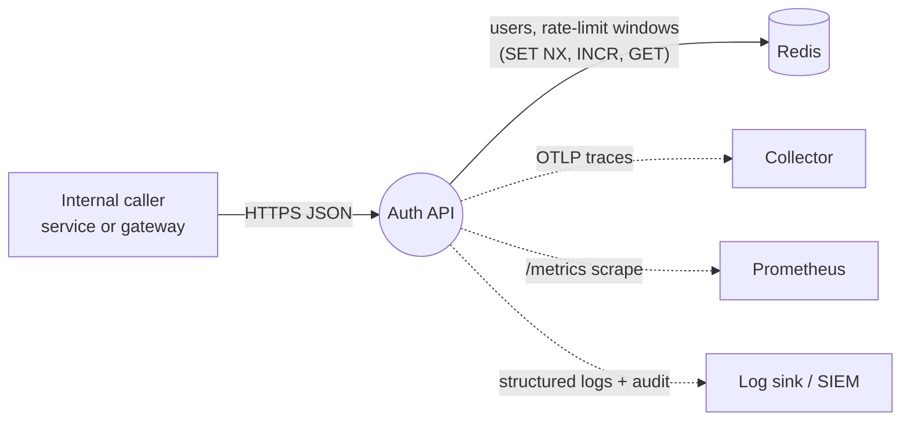
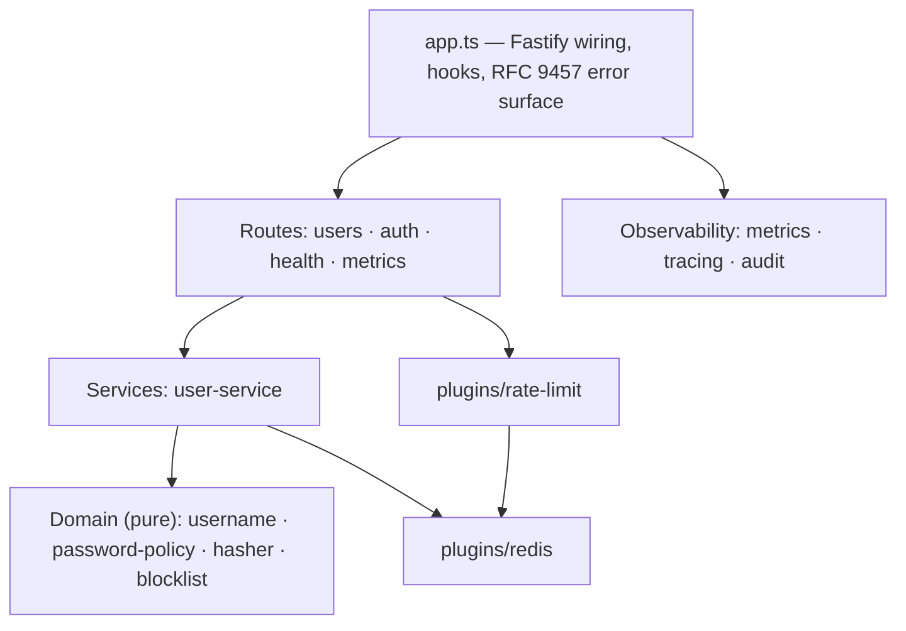
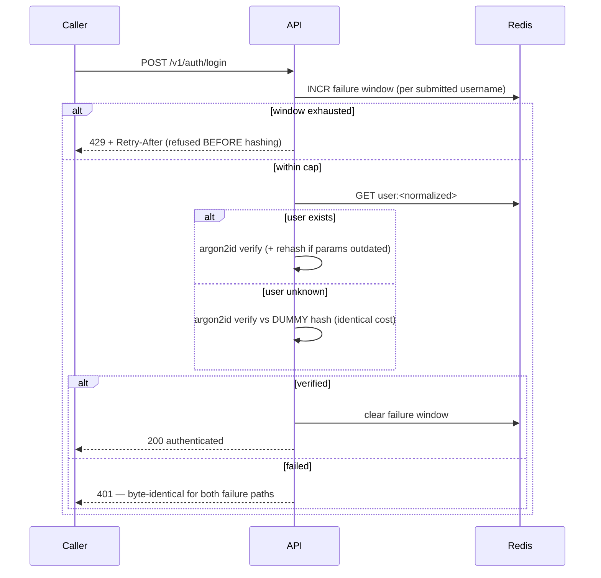
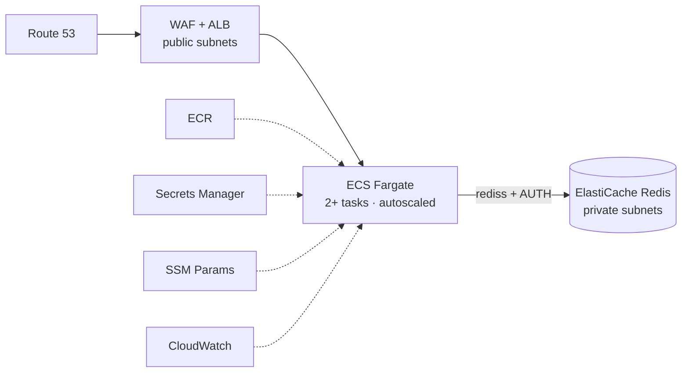

# Architecture (arc42)

A structured architecture overview of the Authentication API, following the
[arc42](https://arc42.org) template. It's written to be **skimmed in ~5 minutes**
and to hold the important considerations underneath.

> **⏱️ If you only have two minutes**, read these four:
> §1 [Goals](#1-introduction--goals) · §4 [Solution strategy](#4-solution-strategy) ·
> §8.1 [Security model](#81-security-model-the-crown-jewel) · §10 [Quality scenarios](#10-quality-requirements).
>
> **Companions:** narrative overview in [architecture.md](architecture.md) · threat model in
> [SECURITY.md](../SECURITY.md) · decisions in [ADRs](adr/) · live
> [playground](https://arashm0z.github.io/auth-api/playground.html) ·
> [infrastructure](https://arashm0z.github.io/auth-api/).

---

## 1. Introduction & Goals

An **internal** REST service that does two things: **create a login** and
**verify a username/password pair**. No sessions, no tokens — verification only
(that's the brief; see [ADR-0005](adr/0005-no-sessions-or-jwt.md)).

**Top quality goals (in priority order):**

| #   | Goal            | What it means here                                                                                                                                                  |
| --- | --------------- | ------------------------------------------------------------------------------------------------------------------------------------------------------------------- |
| 1   | **Security**    | Credentials stored with Argon2id; no username enumeration (identical response **and timing**); brute-force and memory-DoS resistant; standards-cited, not folklore. |
| 2   | **Correctness** | Uniqueness is atomic (no races); every error is machine-readable (RFC 9457); the OpenAPI contract is generated from the same schemas that validate at runtime.      |
| 3   | **Operability** | Stateless and horizontally scalable; observable (traces + metrics + audit); fails predictably (load-shed, drain, graceful shutdown).                                |

**Stakeholders:** calling internal services (consumers of the contract),
operators (deploy/observe), security reviewers (threat model), and — for this
take-home — the interviewer reviewing the code.

## 2. Architecture Constraints

| Kind               | Constraint                                                                                                                    |
| ------------------ | ----------------------------------------------------------------------------------------------------------------------------- |
| **Technical**      | Node.js 24 LTS · TypeScript 6 (strict) · Fastify 5 · Redis 8 · Argon2id. AWS + OpenTofu for infra.                            |
| **Standards**      | RFC 9457 (Problem Details) · NIST SP 800-63B-4 (passwords) · OWASP (hashing, headers) · IETF `RateLimit` header draft.        |
| **Organizational** | Take-home: the deliverable is **reviewable** code + IaC, validated at **zero cost** (LocalStack, not a billable AWS account). |
| **Conventions**    | Conventional Commits · ADRs for decisions · CI gates everything before merge.                                                 |

## 3. Context & Scope

The service is a thin, stateless HTTP front over Redis. All durable state lives
in Redis; the app tier holds none.

**External interfaces (the whole surface):**

| Endpoint              | Success          | Notable failures                                                |
| --------------------- | ---------------- | --------------------------------------------------------------- |
| `POST /v1/users`      | 201 + `Location` | 400 · 409 taken · 422 policy · 413/415/429                      |
| `POST /v1/auth/login` | 200              | **401** (identical for wrong-password _and_ unknown-user) · 429 |
| `GET /healthz`        | 200              | — (liveness; no dependency check)                               |
| `GET /readyz`         | 200              | 503 when Redis unreachable (readiness)                          |
| `GET /metrics`        | 200              | Prometheus exposition                                           |
| `GET /docs`           | 200              | Scalar API reference over the OpenAPI doc                       |

## 4. Solution Strategy

The shape of the solution in one table — each row links the decision record:

| Strategy                         | Why                                                                                                                     | ADR                                           |
| -------------------------------- | ----------------------------------------------------------------------------------------------------------------------- | --------------------------------------------- |
| **Fastify over Express**         | Schema-first, fast, first-class TypeScript + JSON-schema validation.                                                    | [0001](adr/0001-fastify-over-express.md)      |
| **Argon2id** password hashing    | Memory-hard, OWASP params, PHC strings, **rehash-on-login** upgrades.                                                   | [0002](adr/0002-argon2id-over-bcrypt.md)      |
| **Atomic uniqueness (`SET NX`)** | The duplicate-registration race is made _structurally impossible_, not merely unlikely.                                 | [0003](adr/0003-atomic-uniqueness-set-nx.md)  |
| **201 Created** on user creation | RFC 9110 semantics over a literal 200.                                                                                  | [0004](adr/0004-201-created-deviation.md)     |
| **No sessions/JWT**              | The brief asks only to _verify_ — issuing tokens would be scope creep and extra attack surface.                         | [0005](adr/0005-no-sessions-or-jwt.md)        |
| **RFC 9457 everywhere**          | One uniform, machine-readable error surface with stable `code`s.                                                        | [0006](adr/0006-rfc9457-problem-details.md)   |
| **NIST 800-63B-4 policy**        | Length + blocklist, no composition theatre; passphrases welcome.                                                        | [0007](adr/0007-nist-password-policy.md)      |
| **Custom Redis rate limiter**    | Needed IETF `RateLimit` headers + per-username semantics + cross-replica correctness a generic middleware doesn't give. | [0008](adr/0008-custom-redis-rate-limiter.md) |

**The three big ideas:** (1) _stateless app, all state in Redis_ → scale
horizontally with no coordination; (2) _security by default_ → the safe path is
the only path (no enumeration oracles, no unbounded work); (3) _fail fast and
drain_ → shed load and drain readiness rather than melt.

## 5. Building Block View

Level 1 — the app decomposed by responsibility (dependencies point down):

| Block                   | Responsibility                                                                                                                               |
| ----------------------- | -------------------------------------------------------------------------------------------------------------------------------------------- |
| `app.ts`                | Composition root: security plugins, the RFC 9457 error handler, per-IP rate-limit hook, correlation IDs, route registration.                 |
| `domain/*`              | **Pure** logic — username normalization (homoglyph/case defenses), password policy, Argon2id wrapper, blocklist. No I/O, trivially testable. |
| `services/user-service` | Orchestrates domain + Redis (create with `SET NX`, verify credentials, rehash).                                                              |
| `plugins/rate-limit`    | Fixed-window counters in Redis; emits `RateLimit`/`RateLimit-Policy` headers.                                                                |
| `plugins/redis`         | Connection factory; lifecycle owned by the composition root (not a request hook).                                                            |
| `observability/*`       | Prometheus metrics, OpenTelemetry tracing, structured audit events.                                                                          |

## 6. Runtime View

**Login — the flow that carries the security design** (the branch most
implementations miss is _unknown user_):

Two properties fall out of this shape: the rate gate is consumed **before** the
expensive hash (a flood can't force unbounded Argon2 work), and unknown-user vs
wrong-password are indistinguishable by **body and timing**.

**Create user** is a single atomic `SET NX user:<name>` — the conflict is
decided by Redis, so 8 concurrent identical registrations yield exactly one 201
and seven 409s (there's a test that proves it).

**Shutdown / overload:** `close-with-grace` drains in-flight requests (≤10s)
then closes; `@fastify/under-pressure` sheds load with `503 + Retry-After` when
the event loop saturates; `/readyz` reports 503 when Redis is unreachable so the
load balancer drains the instance.

## 7. Deployment View

Runs as a container on **ECS Fargate** behind an ALB, with **ElastiCache Redis**
in private subnets. The full graph is defined in OpenTofu and **applied on
LocalStack** (56 resources, $0, re-checked in CI) — see
[infra/](../infra/) and the [live infra page](https://arashm0z.github.io/auth-api/).

Traffic is admitted tier-to-tier by **security-group reference only**
(`edge → alb :443 → app :3000 → redis :6379`). Fargate sits in _public_ subnets
locked to the ALB's SG — a deliberate cost trade-off (skips ~$65/mo of NAT),
called out in `network.tf` and §11.

## 8. Cross-cutting Concepts

### 8.1 Security model (the crown jewel)

| Concern                   | How it's handled                                                                                                                                                                    |
| ------------------------- | ----------------------------------------------------------------------------------------------------------------------------------------------------------------------------------- |
| **Enumeration**           | Wrong-password and unknown-user return a **byte-identical 401** and **statistically indistinguishable timing** (dummy Argon2id verify for unknown users). No 404/400 format oracle. |
| **Brute force**           | Two Redis-backed limiters: coarse **per-IP** (all routes) + **per-username failure** window consumed _before_ hashing; clears on success.                                           |
| **Memory DoS**            | Each in-flight Argon2 verify reserves ~19 MiB; a hard **concurrency cap** gates hashing (default 8) so a login burst can't exhaust memory.                                          |
| **Injection / smuggling** | Unknown JSON fields **rejected** (not stripped), no type coercion, 16 KiB body cap, JSON-only (415 otherwise), CRLF-safe request IDs.                                               |
| **Leakage**               | `fast-json-stringify` serializes **only** schema fields per status — a hash can't leak into a response. Secrets redacted in logs.                                                   |
| **Secrets**               | Redis auth token + URL in **Secrets Manager**; non-secret config in **SSM**; the task execution role is scoped to exactly those ARNs.                                               |
| **Audit**                 | Structured events (`user.created`, `auth.failure`, `auth.rate_limited`, …) with request IDs, never credentials.                                                                     |

Full threat model + production punch list: [SECURITY.md](../SECURITY.md).

### 8.2 Error handling

Every non-2xx is `application/problem+json` (RFC 9457) with a stable `code` and a
`requestId` that correlates to logs. Validation failures return **all** violated
rules at once. One place deliberately withholds detail: login failures (generic 401).

### 8.3 Observability

OpenTelemetry traces (auto-instrumented Fastify), Prometheus metrics (`/metrics`,
bounded-cardinality route labels), structured `pino` logs with redaction, and a
separate audit stream. Health via `/healthz` (liveness) and `/readyz` (Redis).

### 8.4 Resilience & configuration

Load shedding (under-pressure → 503), readiness draining, graceful SIGTERM
shutdown for zero-downtime rollouts. Config is validated at boot; see
[CONFIGURATION.md](CONFIGURATION.md). The app is stateless, so a task can be
killed or added at any time.

## 9. Architecture Decisions

All decisions live as ADRs in [`docs/adr/`](adr/): Fastify
([0001](adr/0001-fastify-over-express.md)), Argon2id
([0002](adr/0002-argon2id-over-bcrypt.md)), atomic uniqueness
([0003](adr/0003-atomic-uniqueness-set-nx.md)), 201 Created
([0004](adr/0004-201-created-deviation.md)), no sessions
([0005](adr/0005-no-sessions-or-jwt.md)), RFC 9457
([0006](adr/0006-rfc9457-problem-details.md)), NIST policy
([0007](adr/0007-nist-password-policy.md)), custom rate limiter
([0008](adr/0008-custom-redis-rate-limiter.md)).

## 10. Quality Requirements

Quality tree (priority order): **Security ▸ Performance ▸ Operability ▸
Maintainability.** Concrete, testable scenarios:

| Scenario (stimulus)                      | Response                                 | Measure / evidence                                                                                                                    |
| ---------------------------------------- | ---------------------------------------- | ------------------------------------------------------------------------------------------------------------------------------------- |
| Attacker probes which usernames exist    | Identical 401 body **and** timing        | wrong vs unknown: statistically indistinguishable; an integration test asserts identical bodies                                       |
| Credential-stuffing burst on one account | Refused **before** hashing after the cap | `429 + Retry-After`; concurrent-burst test can't beat the cap                                                                         |
| Login flood aimed at memory              | Hashing is bounded                       | concurrency cap (≈152 MiB worst case), not one-per-request                                                                            |
| Redis becomes unreachable                | Instance drained, clean errors           | `/readyz` → 503; a "Redis blows up" test returns a clean 500, no internals leaked                                                     |
| Traffic spike                            | Scale out + shed                         | CPU target-tracking autoscaling; `503 + Retry-After` under pressure                                                                   |
| Throughput ceiling                       | Known and bounded by design              | Argon2id-bound: ≈208 logins/s/task → **~2,000 logins/s at 10 tasks** (health checks ~25k req/s — the hash is the intended bottleneck) |
| Test quality                             | Tests actually catch regressions         | 79 tests (unit + property + integration vs real Redis) + **mutation testing**; 97%+ coverage                                          |

## 11. Risks & Technical Debt

Deliberate trade-offs — **written down, not hidden**:

| Trade-off                                | Why (demo)                                                          | Production move                                  |
| ---------------------------------------- | ------------------------------------------------------------------- | ------------------------------------------------ |
| Fargate in **public** subnets            | Skip ~$65/mo NAT                                                    | Private subnets + VPC endpoints                  |
| HTTP-only ALB listener                   | No cert in a throwaway env                                          | TLS termination + WAF                            |
| AWS-managed encryption keys, 30-day logs | Cost/simplicity                                                     | CMKs + longer retention + SIEM                   |
| Single region                            | Scope                                                               | Route 53 failover + ElastiCache Global Datastore |
| No token issuance                        | Out of scope by design ([ADR-0005](adr/0005-no-sessions-or-jwt.md)) | Add an OIDC/session layer if the brief grows     |

The full production hardening list lives in [SECURITY.md](../SECURITY.md). The
point is knowing the next three moves, not building them prematurely.

## 12. Glossary

| Term                     | Meaning                                                                                         |
| ------------------------ | ----------------------------------------------------------------------------------------------- |
| **Argon2id**             | Memory-hard password hash (OWASP-recommended); resists GPU/ASIC cracking.                       |
| **PHC string**           | Self-describing hash encoding (algorithm + params + salt) enabling transparent rehash-on-login. |
| **Enumeration oracle**   | Any observable difference (status, body, timing) that reveals whether a username exists.        |
| **Fixed-window limiter** | Counter per (subject, window) in Redis; correct across replicas because the state is shared.    |
| **Offline queue**        | node-redis's in-memory buffer of commands while Redis is down (a DoS vector if unbounded).      |
| **Load shedding**        | Returning 503 early under overload instead of accepting work that would collapse the process.   |
| **RFC 9457**             | "Problem Details for HTTP APIs" — the `application/problem+json` error format.                  |
| **NIST 800-63B-4**       | Digital identity guideline: length + blocklist over composition rules.                          |
