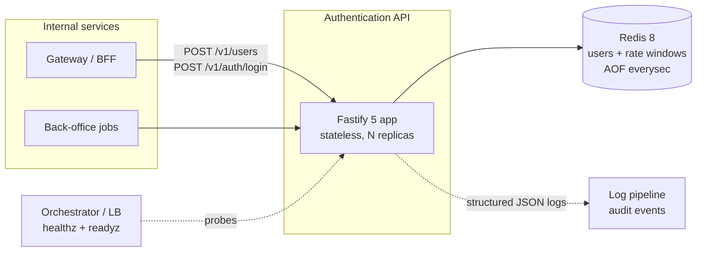
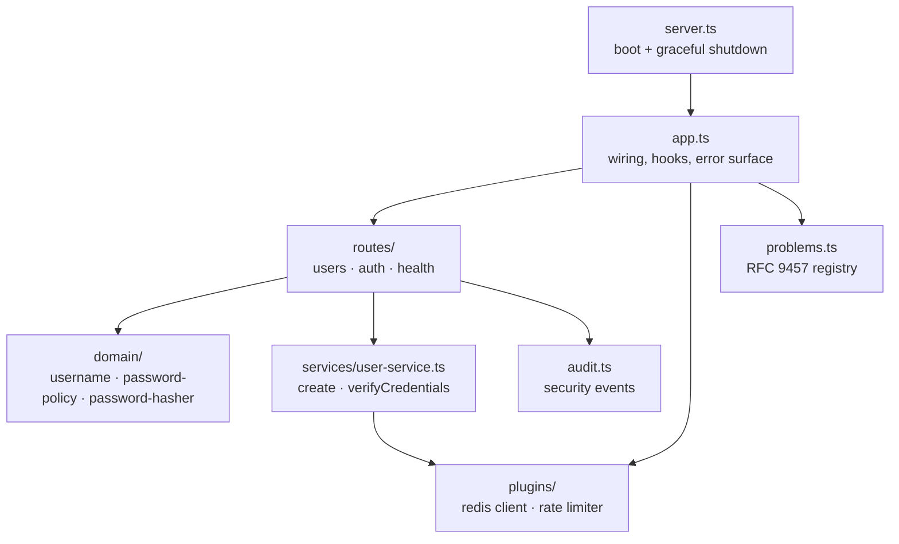

# Architecture

Structure follows a trimmed [arc42](https://arc42.org) template — the
sections that earn their keep at this system size.

## 1. Goals & constraints

**Goals** (from the brief, hardened): RESTful JSON auth API for internal
services — create logins with unique usernames, verify credentials; fast;
secure enough to pass an audit; production-level quality.

**Constraints**: Node.js runtime and Redis for data storage (both mandated);
no time-boxed feature beyond the two capabilities (scope discipline is a
feature); zero-cost demo (infra validated statically, not applied).

**Quality priorities**: security > correctness > operability > throughput >
feature count.

## 2. Context

Consumers are other backend services (no browsers — hence no CORS, no
cookies). The API's outputs besides responses: structured audit logs and
probe endpoints.

## 3. Solution strategy

One source of truth per concern:

- **TypeBox schemas** → runtime validation (AJV), static types (type
  provider), OpenAPI document, response whitelisting. Contract drift is a CI
  failure, not a possibility.
- **Redis primitives** → correctness guarantees: `SET NX` for atomic
  uniqueness, `INCR`+`EXPIRE NX` windows for distributed rate limiting.
- **Argon2id PHC strings** → self-describing credential storage that can
  upgrade itself (rehash-on-login).
- **RFC 9457** → single error shape for every failure mode.

## 4. Building blocks

Layering rule: routes translate HTTP ↔ domain; domain knows nothing about
HTTP; `user-service` owns Redis key layout; nothing below `app.ts` imports
Fastify reply types. Branded types (`NormalizedUsername`, `PasswordHash`)
make cross-layer misuse a compile error.

## 5. Runtime view

The two interesting flows are in the README (login sequence diagram with the
dummy-hash branch) and ADR-0003 (atomic create). Boot order matters:
config validation → helmet/under-pressure → swagger → Redis connect →
hasher init (precomputes the timing-equalization dummy hash) → hooks →
error handlers → routes.

## 6. Deployment

- **Local/reviewer**: `docker compose up` — prod-target image (non-root, no
  devDependencies) + Redis with AOF everysec and healthchecks.
- **AWS (defined in [infra/](../infra/), validated, not applied)**: ECR →
  ECS Fargate (per-env task count, circuit-breaker deploys, target-tracking
  autoscaling) behind an ALB health-checked on `/readyz`; ElastiCache Redis
  with at-rest + in-transit encryption; the Redis auth token / URL come from
  **AWS Secrets Manager** and non-secret config from **SSM Parameter Store**
  (see [CONFIGURATION.md](CONFIGURATION.md)); `TRUST_PROXY=true` so client IPs
  come from the ALB. Multi-environment (dev/staging/prod) with per-env state.

## 7. Crosscutting concepts

- **Correlation**: `X-Request-Id` accepted (validated) or minted, echoed on
  every response, embedded in every log line and problem body.
- **Config**: environment-only, validated at boot with named errors; no
  config library, no runtime surprises.
- **Logging**: pino JSON; bodies never logged; password paths redacted as
  defense in depth; audit events are the forensic record.
- **Failure policy**: shed load early (under-pressure), fail readiness on
  dependency loss, drain on shutdown, sanitize every 500.

## 8. Risks & technical debt

| Risk                                      | Posture                                                                                                                   |
| ----------------------------------------- | ------------------------------------------------------------------------------------------------------------------------- |
| Redis durability as system of record      | AOF everysec (≤1s loss) documented; RDB+AOF or Postgres for real production                                               |
| Fixed-window limiter burst (≤2× at edges) | Accepted at current thresholds; sliding window listed as refinement                                                       |
| CSP disabled for Swagger UI               | JSON API unaffected; scope per-route or host docs separately in production                                                |
| Single Redis in demo                      | HA path (replication/Sentinel or managed ElastiCache) documented in infra                                                 |
| No token issuance                         | Deliberate scope cut (ADR-0005); next iteration                                                                           |
| IaC test depth                            | `tofu test` asserts security invariants at plan time; policy-as-code (OPA/Conftest) and apply-time sandbox tests deferred |
| Metrics/trace ops wiring                  | `/metrics` + OTLP tracing implemented; scrape config, dashboards, alert rules are environment-side                        |
