# Diagrams

The whole service, drawn. These render live (Mermaid) and are the same source you
can point at in a walkthrough. For a hand-tuned interactive version, see the
companion visual guide linked from the README.

## 1. System context

Where the service sits: internal callers in, Redis + logs + orchestrator around
it. No browsers — so no CORS, no cookies.

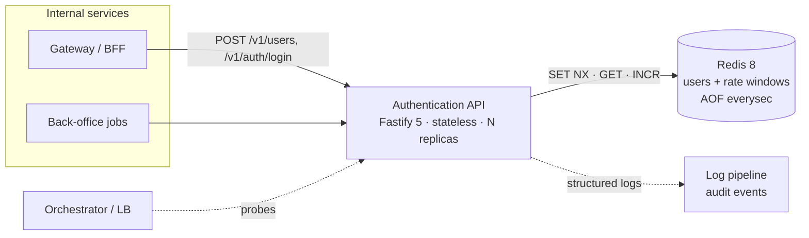

## 2. Boot & wiring order

Config fails fast; the hasher precomputes the dummy hash **before** any request
can arrive, so the very first login is already timing-safe.

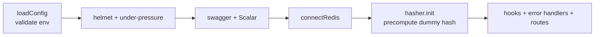

## 3. Request lifecycle (Fastify hooks)

Cross-cutting concerns are hooks, not per-route code, so they can't be forgotten.

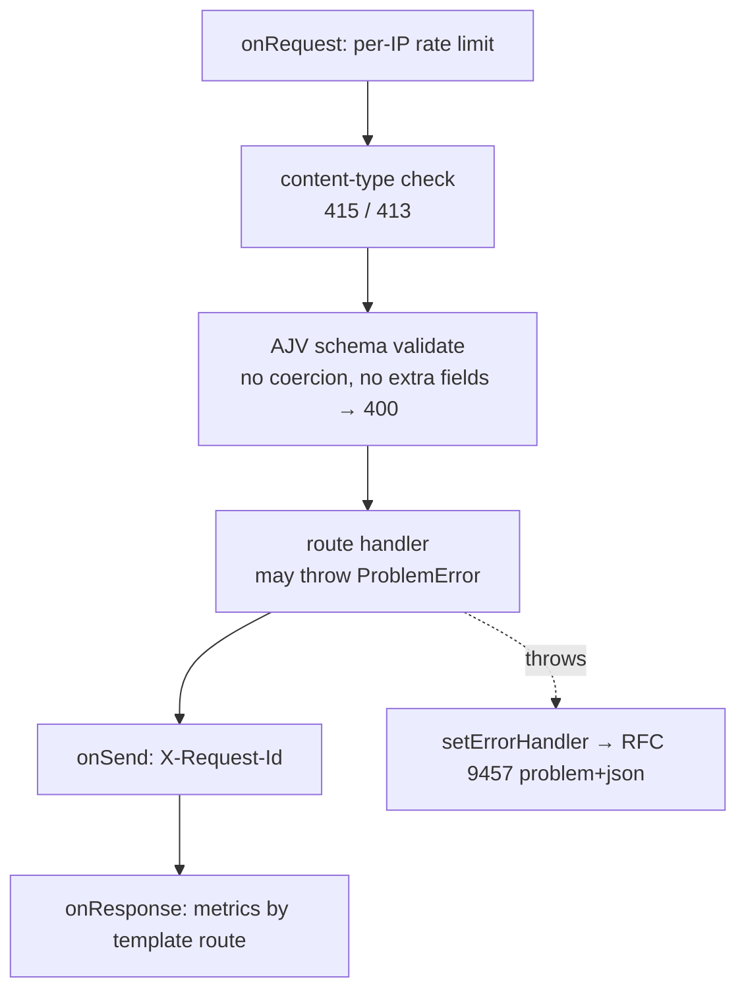

## 4. Create-user flow

Uniqueness is a single `SET NX`; a `nil` reply is the "already taken" verdict.

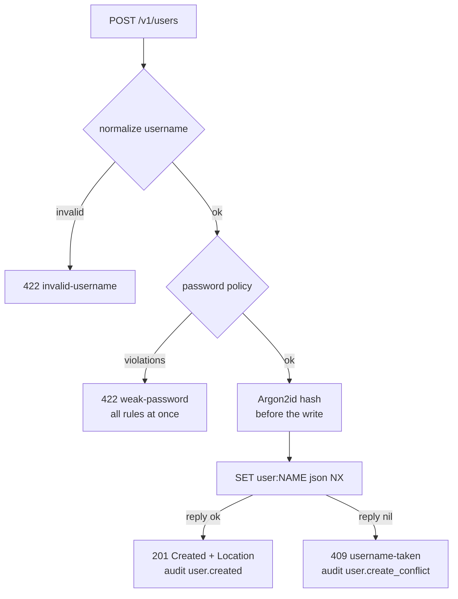

## 5. Login — the timing-safe sequence ★

Unknown-user, wrong-password, and bad-format all cost the same and return the same
401. The gate increments **before** the hash (the TOCTOU fix).

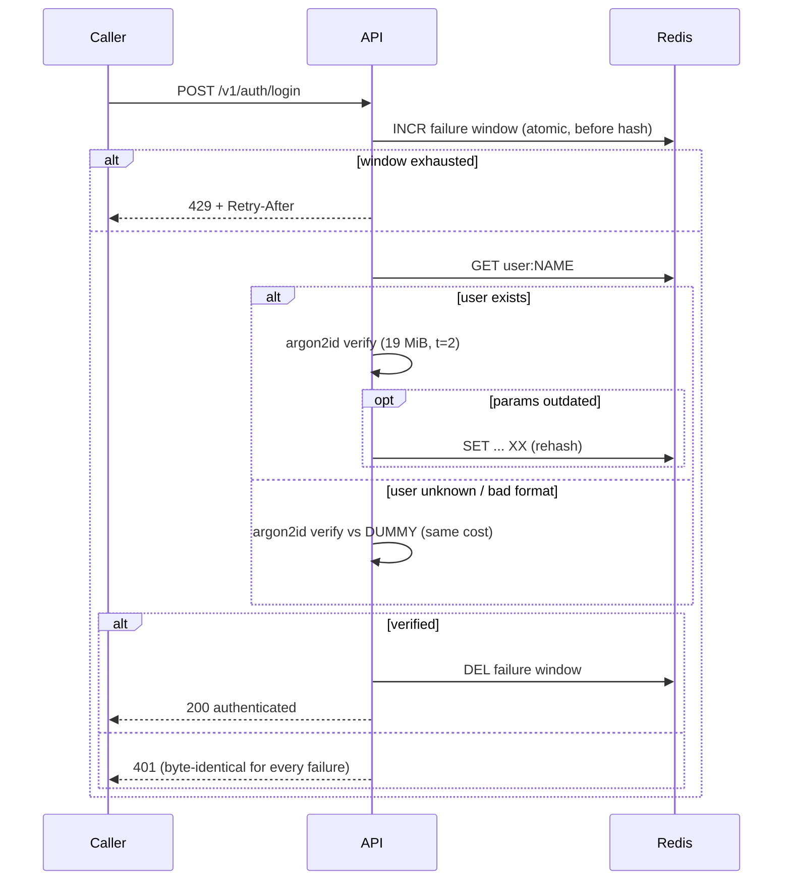

## 6. Rate limiter & the TOCTOU fix

`INCR` first, then compare — Redis serializes the increments, so at most `max`
guesses ever reach the expensive verify.

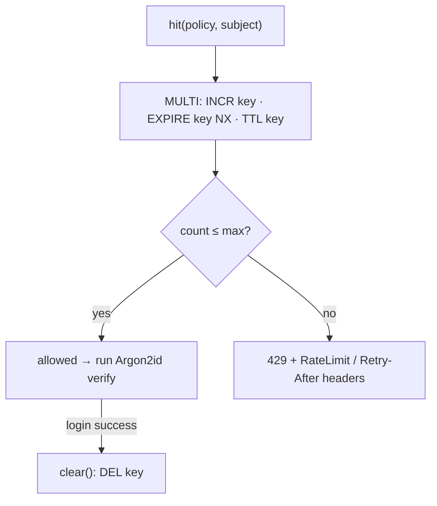

## 7. Password hashing: the memory gate

Each in-flight hash reserves ~19 MiB; the gate caps that at `8 × 19 ≈ 152 MiB`.

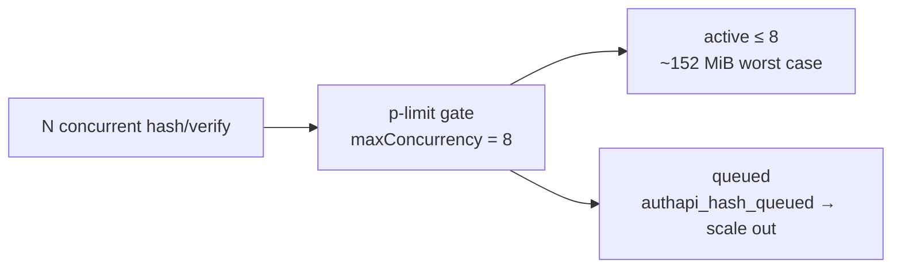

## 8. Redis data model

Three key shapes — the entire persistent footprint.

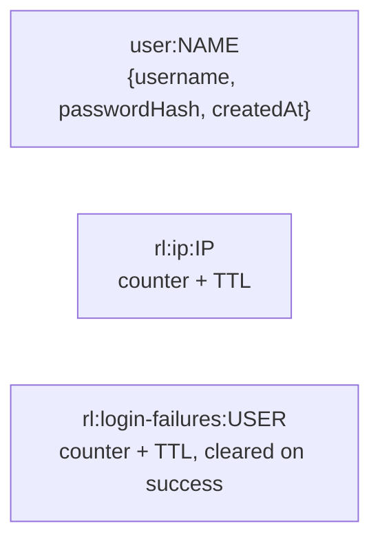

## 9. Error model — one shape, every failure

Every non-2xx is `application/problem+json` with a stable `code` and `requestId`.

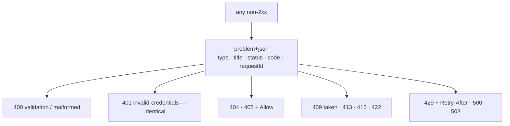

## 10. Component layers

HTTP knowledge stays at the top; the domain knows nothing about Fastify.

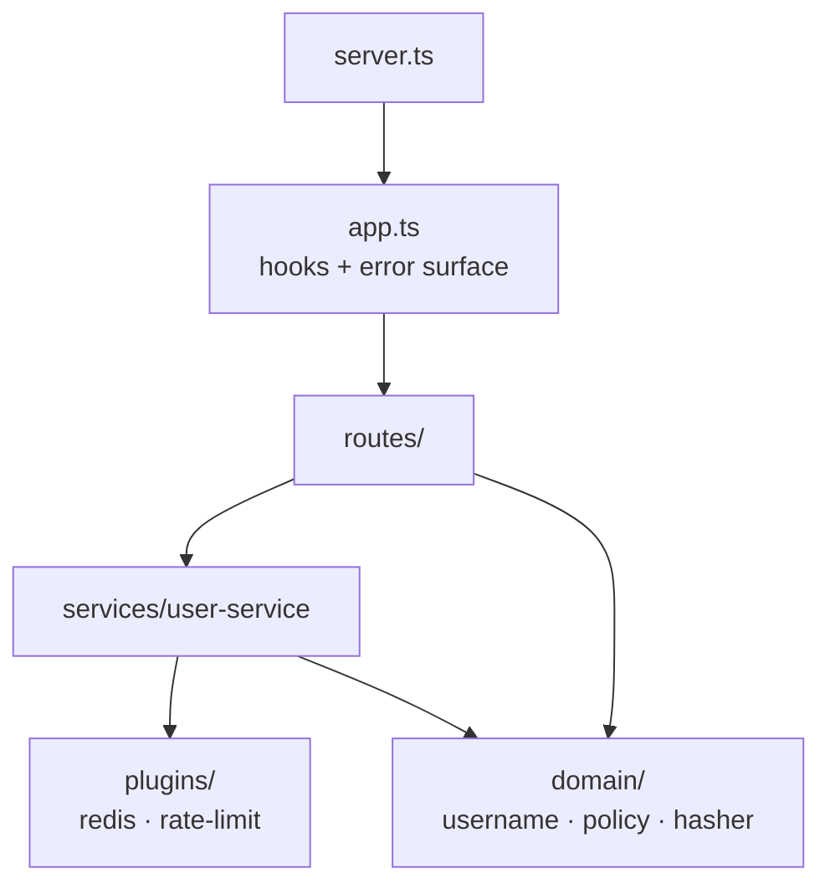

## 11. Testing strategy

Wide base of fast tests; mutation testing on top checks the tests themselves.

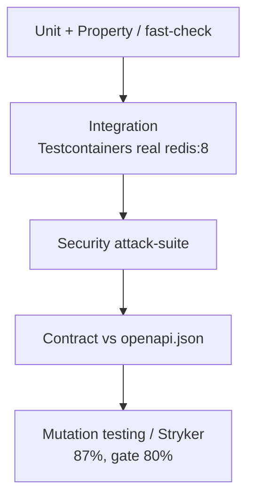

## 12. CI/CD pipeline

Every push runs the full gate; a red check blocks merge.

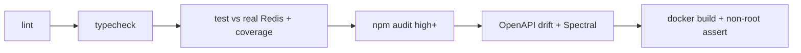

## 13. AWS infrastructure (OpenTofu)

Image from ECR, secrets from Secrets Manager, config from SSM — nothing sensitive
in plain env.

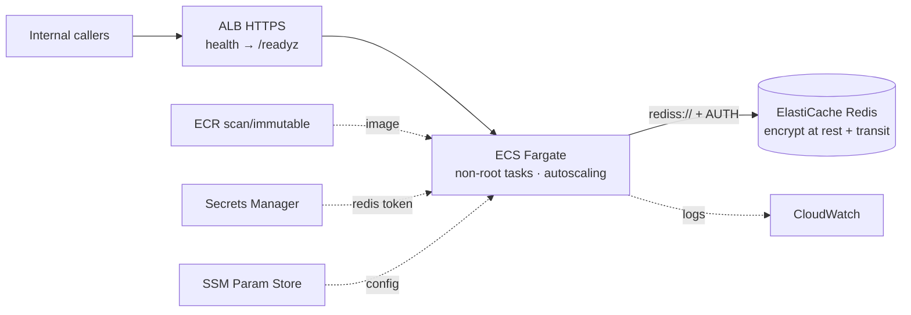
