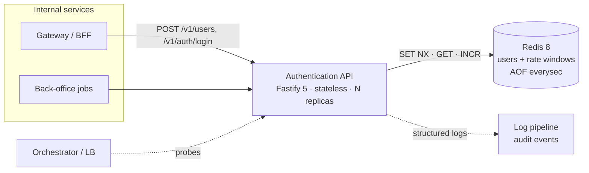
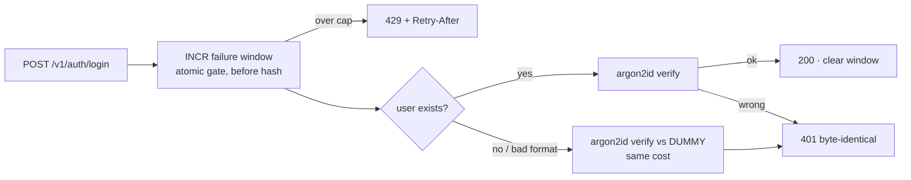

# Authentication API — Architecture Documentation

An internal REST service that **creates logins** and **verifies credentials** —
nothing more, by design. Built on **Node.js 24**, **TypeScript 6 (strict)**,
**Fastify 5**, and **Redis 8**, with **Argon2id** password storage.

This site is the architecture documentation, structured on
[arc42](https://arc42.org). Every significant decision has a **solid, written
rationale** and cites the standard it implements (NIST SP 800-63B-4, OWASP,
RFC 9457, RFC 9110) rather than folklore.

<!-- prettier-ignore-start -->
<!-- Material grid cards need 4-space continuation indents (python-markdown);
     prettier would collapse them to 2 and break the cards out of their <li>. -->
<div class="grid cards" markdown>

-   :material-scale-balance:{ .lg .middle } **[Design rationale](design-rationale.md)**

    ---

    The quality goals, the priority ordering, and every major decision as
    _decision → forces → rationale → alternatives rejected → consequences_.

-   :material-sitemap:{ .lg .middle } **[Architecture (arc42)](architecture.md)**

    ---

    Context, building blocks, runtime, deployment, and cross-cutting concepts.

-   :material-chart-sankey:{ .lg .middle } **[Diagrams](diagrams.md)**

    ---

    The whole system drawn — 13 Mermaid diagrams from system context down to a
    single Redis command.

-   :material-shield-lock:{ .lg .middle } **[Security model](security.md)**

    ---

    Threat model, the timing-safe login, and the honest residual risks.

-   :material-gavel:{ .lg .middle } **[Compliance & AI governance](COMPLIANCE.md)**

    ---

    OSFI E-23 / B-13 / B-10, PIPEDA, and how I'd govern an AI mortgage feature.

-   :material-robot-happy:{ .lg .middle } **[AI workflow](AI_WORKFLOW.md)**

    ---

    How AI was used — and why the judgment calls are mine to defend.

-   :material-play-circle:{ .lg .middle } **[Live tools](https://arashm0z.github.io/auth-api/playground.html)**

    ---

    Try it, don't just read it: the [request playground](https://arashm0z.github.io/auth-api/playground.html),
    the [API reference](https://arashm0z.github.io/auth-api/api.html), the
    [rate-limiter demo](https://arashm0z.github.io/auth-api/ratelimit.html), and the
    [infrastructure tour](https://arashm0z.github.io/auth-api/).

</div>
<!-- prettier-ignore-end -->

## The system in one picture



And the flow everything else defends — login, timing-safe on every path:



All 13 diagrams, from system context to a single Redis command:
**[Diagrams →](diagrams.md)**

## At a glance

|                      |                                                                                                                |
| -------------------- | -------------------------------------------------------------------------------------------------------------- |
| **Endpoints**        | `POST /v1/users` (201) · `POST /v1/auth/login` (200/401) · `/healthz` · `/readyz` · `/metrics`                 |
| **Password storage** | Argon2id (OWASP params), PHC strings, rehash-on-login                                                          |
| **Uniqueness**       | Redis `SET NX` — the check-then-set race is structurally impossible                                            |
| **Login safety**     | Wrong-password and unknown-user are identical in body, headers, **and timing**                                 |
| **Errors**           | RFC 9457 `application/problem+json`, stable `code` + `requestId`, everywhere                                   |
| **Rate limiting**    | Two Redis-backed windows (per-IP, per-username failures) — correct across replicas                             |
| **Tests**            | 79 tests, ~96% coverage, 5 layers + Stryker mutation testing (87%, gate 80%)                                   |
| **Infra**            | OpenTofu → ECS Fargate + ALB + ElastiCache + ECR — applied end-to-end on LocalStack (emulated AWS), zero spend |

## The testing & verification arsenal

Everything that has to pass before a change ships:

| Tool                                              | What it proves                                                                                                                                                                                                                                 |
| ------------------------------------------------- | ---------------------------------------------------------------------------------------------------------------------------------------------------------------------------------------------------------------------------------------------- |
| **Vitest 4** (unit)                               | password policy, username normalization, problem registry                                                                                                                                                                                      |
| **fast-check** (property-based)                   | thousands of adversarial Unicode inputs — normalization idempotence, never-throws, policy invariants                                                                                                                                           |
| **Testcontainers** (integration, real `redis:8`)  | `SET NX` race, byte-identical 401, rehash-on-login, both rate limiters, every protocol edge — identical suite on a laptop and in CI                                                                                                            |
| **Security attack-suite**                         | each test is an attack that must fail: enumeration, timing, injection, mass assignment, CRLF, leakage                                                                                                                                          |
| **Contract tests + OpenAPI drift gate**           | live responses validated against the committed `openapi.json`; CI regenerates and diffs, so docs cannot lie                                                                                                                                    |
| **Stryker (mutation testing)**                    | mutates the domain logic and fails CI if the tests don't kill the mutants — measures whether assertions _catch_ regressions, not just line coverage. Score **87%**, gated at 80%                                                               |
| **autocannon** (benchmark)                        | measured login ceiling ≈ the `HASH_MAX_CONCURRENCY ÷ verify-time` math, within 4%                                                                                                                                                              |
| **Spectral**                                      | OpenAPI contract lint                                                                                                                                                                                                                          |
| **CodeQL · gitleaks · Trivy · dependency-review** | SAST, secret scan, container-image CVEs, vulnerable-dependency gate on PRs                                                                                                                                                                     |
| **tofu test · tflint · checkov**                  | IaC security invariants asserted at plan time                                                                                                                                                                                                  |
| **LocalStack apply**                              | the _entire_ AWS stack (VPC → ECS → ElastiCache → ALB → Route 53 → Secrets) provisioned for real against emulated AWS APIs — an integration test for the Terraform itself, $0 spend. See the [live tour](https://arashm0z.github.io/auth-api/) |

## Quickstart

```bash
docker compose up --build   # API on :3000, Redis with AOF durability
# interactive docs (Scalar): http://localhost:3000/docs
```

> Prefer the interactive version? The
> **[landing site](https://arashm0z.github.io/auth-api/)** has the
> deployed-architecture tour, a request
> **[playground](https://arashm0z.github.io/auth-api/playground.html)**, and a
> live **[rate-limiter demo](https://arashm0z.github.io/auth-api/ratelimit.html)**.

> The quality priority order that drives every trade-off on this site:
> **security > correctness > operability > throughput > feature count.**
