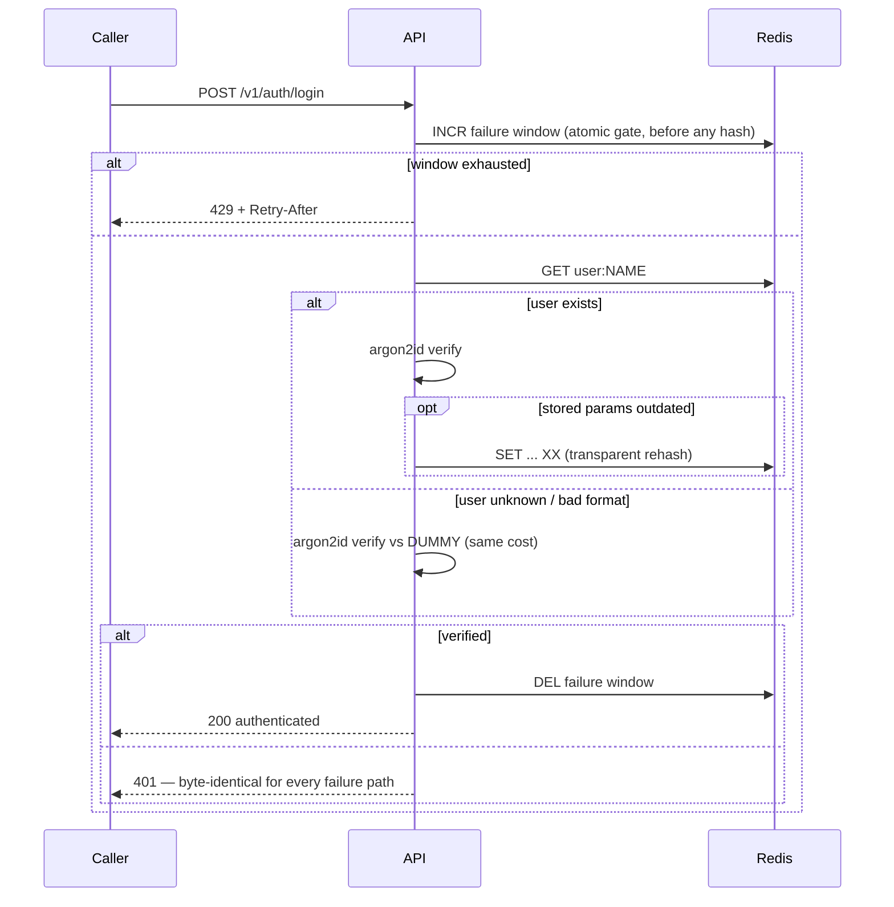

# Security Model

What is defended, how, and where the residual risks are — standards cited by name
so every choice is auditable rather than a matter of taste. The full threat table,
rejected alternatives, and production punch-list live in the repository's
[`SECURITY.md`](https://github.com/ArashM0z/auth-api/blob/main/SECURITY.md); this
page is the architecture-level view.

## The login flow, including the branch that's easy to get wrong

## Threat model & mitigations

| Threat                               | Mitigation                                                                                                                                                               |
| ------------------------------------ | ------------------------------------------------------------------------------------------------------------------------------------------------------------------------ |
| Credential theft from a leaked store | Argon2id (OWASP first-choice, memory-hard), PHC strings with per-password salts, rehash-on-login                                                                         |
| Brute force / credential stuffing    | Per-username failure window (10/15 min, clears on success) + per-IP window (100/min), both in Redis so limits hold across replicas; Argon2id cost caps guess rate        |
| Enumeration — response oracle        | Wrong-password and unknown-user return byte-identical 401s; loose login schema so malformed usernames also 401, not 400                                                  |
| Enumeration — timing oracle          | Unknown users burn a dummy Argon2id verify; registration hashes **before** the uniqueness check so 409s cost the same as 201s                                            |
| Duplicate-account race               | `SET NX` atomic create-if-absent — no check-then-set window (concurrency test)                                                                                           |
| Homoglyph / case-trick accounts      | Usernames NFC-normalized, lowercased, restricted to `[a-z0-9._-]`                                                                                                        |
| Weak passwords                       | NIST SP 800-63B-4: ≥15 code points, no composition rules, 10k blocklist, reject-never-truncate                                                                           |
| Memory-exhaustion DoS via hashing    | `p-limit` gate: worst case `HASH_MAX_CONCURRENCY × 19 MiB`                                                                                                               |
| Event-loop overload                  | `@fastify/under-pressure` sheds load with 503 + `Retry-After`                                                                                                            |
| Mass assignment / smuggled fields    | AJV `removeAdditional:false` + `additionalProperties:false` — unknown fields rejected, not stripped                                                                      |
| Secrets in responses                 | Response-schema serialization whitelists fields per status — a hash structurally cannot appear                                                                           |
| Secrets in logs                      | Bodies never logged; pino `redact` censors password paths as defense in depth                                                                                            |
| Missing forensic trail               | Structured audit events with request id + IP, never credentials                                                                                                          |
| Supply chain                         | Lockfile, `npm audit` gate, CodeQL, gitleaks, Trivy image scan, dependency-review on PRs, checkov (SARIF to the Security tab), Dependabot (npm/actions/docker/terraform) |

## Residual risks (named on purpose)

Volunteering the limits is the point — each has a mitigation and a next step.

- **Redis as primary store.** AOF `everysec` bounds crash-loss to ~1s. A
  production system of record would be Postgres, with Redis for rate-limiting and
  sessions.
- **Fixed-window limiter** allows ≤2× burst at window edges — acceptable at these
  thresholds; sliding-window is the documented refinement.
- **Timing equalization holds only while hash parameters are uniform.** If an
  operator raises Argon2id parameters, an existing account whose stored hash still
  encodes the older, cheaper parameters (and hasn't re-authenticated to trigger
  rehash-on-login) verifies slightly faster than the unknown-user path — a narrow,
  transient enumeration signal, bounded by the per-username limiter. Fix: pin the
  dummy hash to the weakest deployed parameters, or enforce a constant minimum
  handler time, and pair a parameter bump with a forced-rehash migration.
  _(Surfaced by the adversarial review.)_
- **409 on registration reveals username existence.** Unavoidable for username
  signup; the login side leaks nothing and registration is IP-rate-limited.

## Compliance mapping (SOC 2-style controls)

| Control area                     | Evidence                                                                                                |
| -------------------------------- | ------------------------------------------------------------------------------------------------------- |
| Access control / least privilege | Non-root container; scoped IAM task roles in `infra/`; Redis SG reachable only from the app SG          |
| Change management                | CI gates (lint, typecheck, real-Redis tests, coverage, audit, CodeQL, OpenAPI-drift, IaC scans)         |
| Monitoring & incident response   | Structured audit log with correlation ids; health probes; load-shedding signals                         |
| Confidentiality                  | Argon2id at-rest; encryption in transit + at rest in the IaC (customer-managed KMS); no secrets in code |
| Data minimization (PIPEDA)       | Per user, only username + hash + timestamps are stored — nothing else exists to breach                  |

The regulatory framing (OSFI E-23 / B-13 / B-10, PIPEDA) is on the
[Compliance](COMPLIANCE.md) page.

## Required before real production

The full pre-production task list — TLS everywhere, token issuance,
breached-password screening, lockout escalation, MFA, secret rotation,
observability wiring, and compliance operationalization — is tracked on the
[Roadmap & technical debt](roadmap.md#required-before-a-real-production-deployment)
page, each with its reason and next step.
