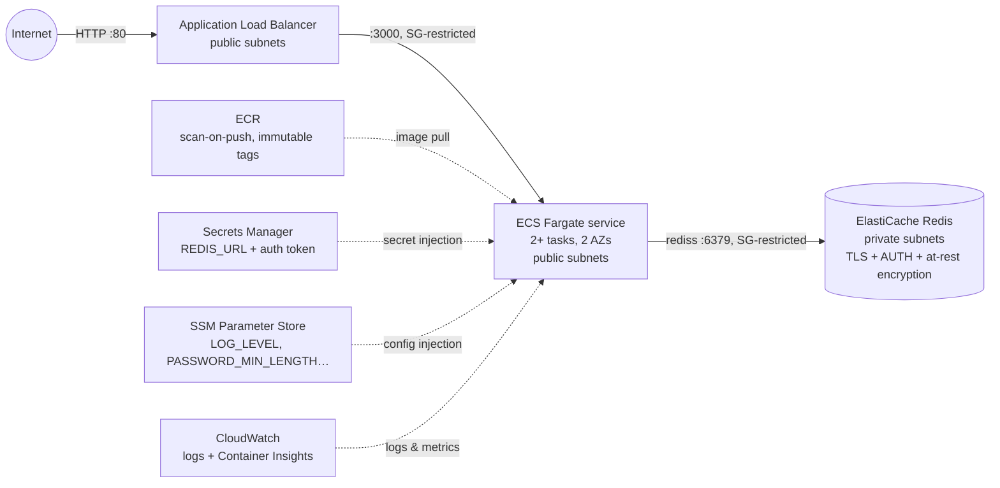

# Infrastructure (OpenTofu / Terraform, AWS)

Demonstration-quality IaC for running the auth API on AWS in `ca-central-1`.
It is **validated statically, never applied**; see
[Why this is not applied](#why-this-is-not-applied).

## What it provisions



Deployed per environment (`dev` / `staging` / `prod`) with env-prefixed
resource names and per-environment state; see
[../docs/CONFIGURATION.md](../docs/CONFIGURATION.md). **Secrets** (the Redis
auth token and full `rediss://` URL) live in AWS Secrets Manager; **non-secret
config** lives in SSM Parameter Store; the ECS task's execution role is scoped
to just those ARNs.

Traffic is admitted tier-to-tier by security-group reference only:
`internet → alb SG (:80) → app SG (:3000) → redis SG (:6379)`. The ALB
health-checks `/readyz` (which includes the Redis dependency) so tasks that
lose Redis are drained; the container itself health-checks `/healthz`
(process liveness) so ECS doesn't kill healthy processes over a Redis blip.
Autoscaling target-tracks 60% CPU between 2 and 10 tasks.

## Why Fargate runs in public subnets

Cost. The textbook layout (tasks in private subnets, NAT gateway for
egress) adds **~USD 65+/month** of NAT before any traffic. Here the tasks
get public IPs for egress (ECR pulls, CloudWatch, SSM) but their security
group only admits ingress **from the ALB**, so they are not reachable from
the internet. Production would use private subnets with NAT gateways or VPC
endpoints; the trade-off is called out inline in `network.tf`.

Rough steady-state cost if applied: ALB ~$22 + 2× Fargate task ~$25 +
cache.t4g.micro ~$11 + Container Insights/logs a few dollars ≈
**~USD 60–65/month**.

## Applying it for real

```sh
cd infra
tofu init
tofu plan
tofu apply

# Build and push the image, then point the service at the new tag:
aws ecr get-login-password --region ca-central-1 | \
  docker login --username AWS --password-stdin "$(tofu output -raw ecr_repository_url)"
docker build --target prod -t "$(tofu output -raw ecr_repository_url):v0.1.0" ..
docker push "$(tofu output -raw ecr_repository_url):v0.1.0"
tofu apply -var app_image_tag=v0.1.0

curl "http://$(tofu output -raw alb_dns_name)/healthz"
```

Tags are immutable in ECR, so each build pushes a fresh tag (CI would use
the git SHA) and deploys are `tofu apply -var app_image_tag=<tag>`.

## Why this is not applied

This is a take-home: the deliverable is reviewable IaC, not a running
(billable) environment. Everything here is verified statically. It must
pass `tofu fmt -check`, `tofu validate` (with providers resolved), and
`tflint` cleanly, which proves syntax, types, references, and a large
class of AWS-specific mistakes without creating a single resource.

## CI checks (`.github/workflows/iac.yml`)

On every PR / push to `main` touching `infra/**`:

1. `tofu fmt -check -recursive` — canonical formatting
2. `tofu init -backend=false && tofu validate` — schema/type/reference validation
3. `tflint` — terraform ruleset (recommended preset) + AWS ruleset
4. `checkov` — security/posture scanning, `soft_fail: false`; the handful of
   deliberate demo trade-offs (no NAT, HTTP-only listener, AWS-managed keys,
   30-day logs) are suppressed **inline** next to the resource with a
   written justification, never blanket-skipped

## Why ECS/Fargate — not EKS, Kubernetes, or Helm

A deliberate decision, not a gap. Kubernetes (and Helm to template it) earns
its operational weight when you are running a _fleet_ of services with complex
inter-service networking, custom controllers, or multi-cloud portability
requirements. This is a **single, stateless, two-endpoint service**; on that
shape, ECS Fargate delivers the same "containers behind a load balancer, auto-
scaled, rolling deploys" outcome with a fraction of the operational surface:
no control plane to run, patch, and secure, and (relevant to Lendesk's stack)
it lives natively in the AWS + Terraform world the rest of this repo targets.

Shipping a Helm chart _alongside_ this ECS definition would present a reviewer
with two contradictory deployment stories. If a Kubernetes platform were the
organizational standard, the equivalent artifacts would be a Deployment +
Service + HPA + Ingress (or a small Helm chart), and the app is already ready
for it: stateless, config/secrets injected from the environment, `/healthz`
and `/readyz` for liveness/readiness probes, `/metrics` for a `ServiceMonitor`,
graceful SIGTERM handling for rolling updates, and a non-root image. The
deployment target is a swap; the application contract is unchanged.

## State backend

The demo uses a `local` backend so it is runnable with zero setup.
Production would use the S3 backend with encryption and state locking
(S3-native `use_lockfile`, or a DynamoDB table on older runtimes); the
block is spelled out in `versions.tf`. State matters here because the
generated Redis AUTH token lives in it.
